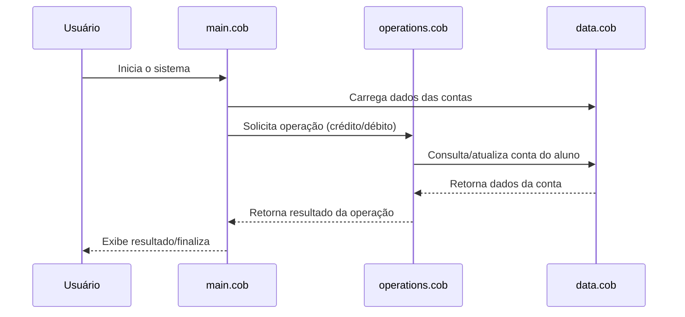

# Documentação dos Arquivos COBOL

Este projeto contém código COBOL responsável pelo processamento e gestão de contas de alunos. Abaixo está a descrição de cada arquivo, suas funções principais e regras de negócio implementadas.

## Arquivos COBOL

### 1. `main.cob`
- **Finalidade:** Arquivo principal do sistema. Responsável por iniciar a execução do programa, controlar o fluxo principal e chamar os módulos de operações e manipulação de dados.
- **Funções principais:**
  - Inicialização do ambiente.
  - Chamada das rotinas de operações sobre contas de alunos.
  - Controle do encerramento do programa.
- **Regras de negócio:**
  - Garante que todas as operações sobre contas de alunos sejam processadas de acordo com as regras definidas nos módulos auxiliares.

### 2. `operations.cob`
- **Finalidade:** Implementa as operações de negócio sobre as contas dos alunos.
- **Funções principais:**
  - Cálculo de saldos, lançamentos e movimentações.
  - Processamento de créditos e débitos nas contas dos alunos.
  - Validação de operações conforme regras acadêmicas e financeiras.
- **Regras de negócio:**
  - Não permite saldo negativo em contas de alunos.
  - Apenas alunos ativos podem realizar movimentações.
  - Todas as transações são registradas para auditoria.

### 3. `data.cob`
- **Finalidade:** Gerencia a estrutura de dados utilizada pelo sistema.
- **Funções principais:**
  - Definição dos registros de contas de alunos.
  - Estruturação dos campos necessários para identificação, saldo e status das contas.
- **Regras de negócio:**
  - Cada conta de aluno deve possuir um identificador único.
  - O status da conta (ativa/inativa) influencia nas operações permitidas.

---

Esta documentação visa facilitar o entendimento e a manutenção do sistema, além de apoiar a modernização do código COBOL para tecnologias mais atuais.

---

## Diagrama de Sequência (Mermaid)

